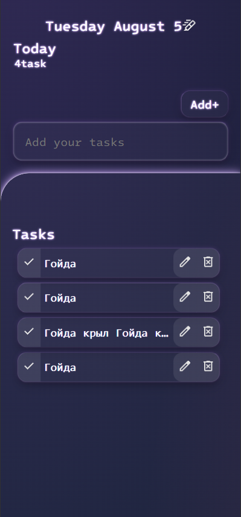

# Pure JavaScript ToDo List

A lightweight, no-framework ToDo list application built with vanilla JavaScript and CSS.  
**Live Demo:** [https://6trinity.github.io/ToDo-List](https://6trinity.github.io/ToDo-List)

## Key Features

### 🚀 Core Functionality
- **Add new tasks** with intuitive input
- **Edit existing tasks** in-place
- **Delete tasks** with one click
- **Task completion** via double-click

### ✨ UX Enhancements
- **Smart task sizing**:
  - Uniform task height in overflow mode
  - Full content expansion on click
- **Clean visual feedback**:
  - Clear completed task styling
  - Smooth animations
- **Responsive design** that works on all devices

### ⚙️ Technical Implementation
- **Zero dependencies** (pure JavaScript + CSS)
- Modern ES6+ syntax
- Semantic HTML structure
- Efficient DOM manipulation

## Usage Guide

1. **Add a task**  
   Type in the input field and press Enter/Add button
2. **Edit task**  
   Click the edit (✏️) icon next to any task
3. **Complete task**  
   Double-click on a task to mark it as done
4. **Delete task**  
   Click the delete (🗑️) icon to remove permanently
5. **View long content**  
   Single-click to expand/collapse tasks

## Why This Project?

This implementation demonstrates:
- Core JavaScript DOM manipulation skills
- CSS layout techniques (Flexbox/Grid)
- State management without frameworks
- UX considerations for task management
- Responsive design principles

---

**Created with 💻 by [Egor]**  
[GitHub Profile](https://github.com/6trinity)